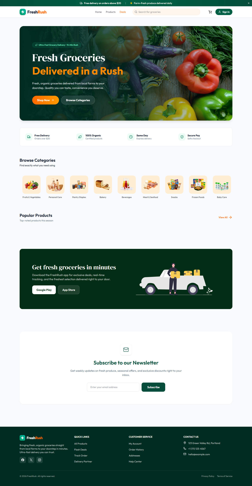
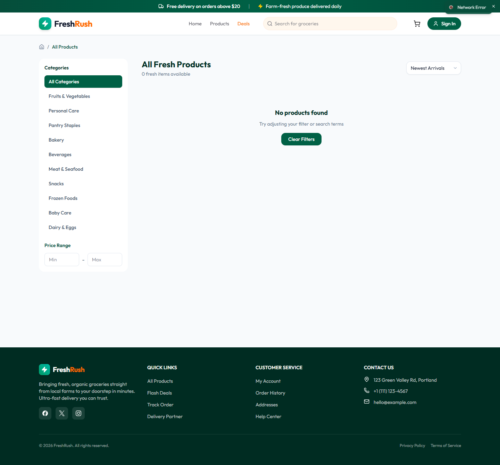
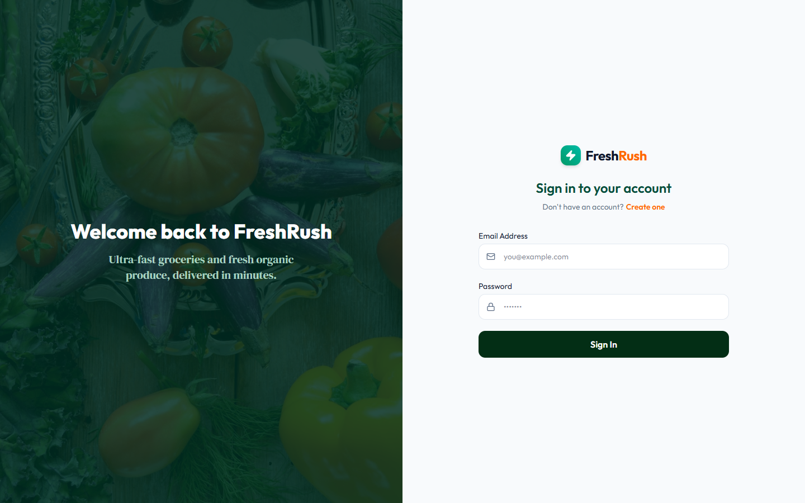
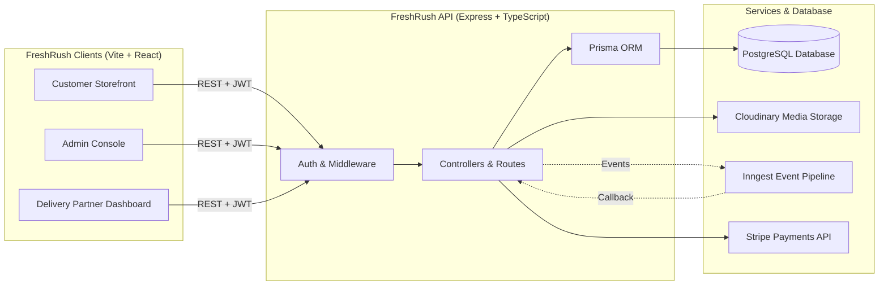

<div align="center">

# ⚡ FreshRush

**An Ultra-Fast, Full-Stack Grocery Delivery Platform** built on Node.js, Express, React, TypeScript, and PostgreSQL — complete with a customer storefront, an admin operations console, and a real-time delivery partner dashboard.

[](https://github.com/anilbodaballa/freshrush)
[](#-license)
[](#)
[](#)

[Repository](https://github.com/anilbodaballa/freshrush) · [Report Bug](https://github.com/anilbodaballa/freshrush/issues) · [Request Feature](https://github.com/anilbodaballa/freshrush/issues)

</div>

---

## 📸 Overview & Preview

**FreshRush** is an end-to-end, multi-role grocery delivery application designed to deliver fresh groceries, produce, daily essentials, and beverages in record time. It models the full lifecycle of modern hyper-local delivery — from browsing and instant cart management to automated driver dispatch and live OTP-verified drop-offs.

<table>
  <tr>
    <td width="50%"><p align="center"><sub>Customer Storefront</sub></p></td>
    <td width="50%"><p align="center"><sub>Product Catalog & Category Filtering</sub></p></td>
  </tr>
  <tr>
    <td width="50%"><p align="center"><sub>Stripe Checkout & Address Management</sub></p></td>
    <td width="50%"><p align="center"><sub>Live Order Tracking Map</sub></p></td>
  </tr>
  <tr>
    <td width="50%"><p align="center"><sub>Admin Console & Sales Metrics</sub></p></td>
    <td width="50%"><p align="center"><sub>Fulfillment & Rider Assignment</sub></p></td>
  </tr>
  <tr>
    <td colspan="2"><p align="center"><sub>Delivery Partner Live Rider Dashboard</sub></p></td>
  </tr>
</table>

---

## 👥 Three Roles, One Platform

| Role | Operational Scope | Key Functionalities |
|---|---|---|
| 🛒 **Customer** | Mobile & Desktop Web | Browse fresh items, category filter, flash deals, cart sidebar, Stripe payments, live order map tracking |
| 🛠️ **Admin** | Business Management | Real-time sales metrics, inventory management (CRUD), order status transitions, delivery partner assignment |
| 🚴 **Delivery Partner** | Delivery Operations | Accept/reject delivery requests, broadcast real-time GPS location, verify drop-off via secure OTP code |

---

## 🏗️ Architecture



---

## ✨ Key Features

### 🛒 Storefront Experience
- **Instant Product Search & Filter**: Real-time filtering by category, price, and flash deal status.
- **Dynamic Shopping Cart**: Slide-out cart drawer with live subtotal calculation and quantity adjustments.
- **Saved Address & Geolocation**: Store multiple delivery addresses with automated coordinate resolution.
- **Stripe Payment Gateway**: Secure card payments with webhook status callbacks.

### 🚴 Delivery Partner Ecosystem
- **Interactive Map Tracking**: Live delivery location streaming.
- **OTP Verification**: Multi-factor delivery validation to prevent incorrect drop-offs.
- **Status Controls**: Toggle availability status and handle active orders effortlessly.

### 👨‍💼 Operations & Administration
- **Analytics Dashboard**: High-level sales revenue summaries, total orders, and active users.
- **Catalog Management**: Add, update, and manage inventory stock levels with Cloudinary image upload.
- **Automated Dispatch**: Event-driven background jobs to assign idle delivery partners to new orders.

---

## 🛠️ Tech Stack

- **Frontend**: React 19, Vite, TypeScript, Tailwind CSS, Lucide Icons, Leaflet / React-Leaflet, React Hot Toast
- **Backend**: Node.js, Express.js, TypeScript, Prisma ORM, JSON Web Tokens (JWT), Nodemailer, Multer
- **Infrastructure**: PostgreSQL, Cloudinary, Inngest, Stripe, Vercel

---

## 🚀 Quick Start Guide

### Prerequisites
- Node.js `v18+`
- PostgreSQL database URL
- Cloudinary & Stripe API credentials

### 1. Clone Repository
```bash
git clone https://github.com/anilbodaballa/freshrush.git
cd freshrush
```

### 2. Setup Server
```bash
cd server
npm install
cp .env.example .env # Update credentials
npx prisma generate
npx prisma db push
npm run seed # Populate initial FreshRush catalog
npm run server
```

### 3. Setup Client
```bash
cd ../client
npm install
cp .env.example .env
npm run dev
```

Visit `http://localhost:5173` to explore **FreshRush**!

---

## 📄 License
This project is open source and released under the [MIT License](LICENSE).
